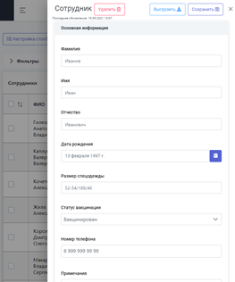
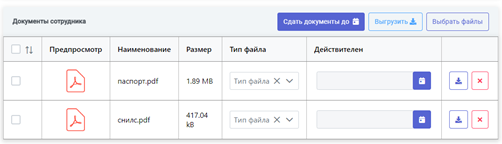
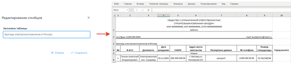
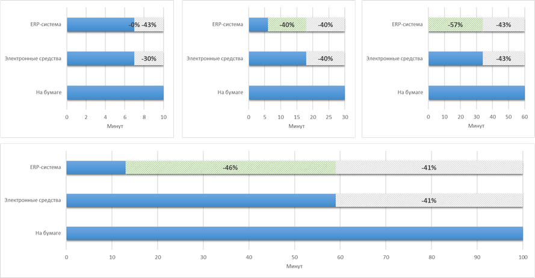

# Personnel Accounting

- The **goal** is to optimize the process of personnel accounting and personnel records management by creating an ERP system.
- The **tasks** are to create a personnel accounting system and automate the process of forming employee documents.
- The **hypothesis** of the study is that by automating part of the company's business processes, the working time during paperwork will significantly decrease.
- **Methods** – automation, document generation, document management, ERP systems.
- **Results** – an ERP system has been developed that automates and increases the efficiency of business processes related to document management and record keeping.

## Technologies

    &nbsp;
    &nbsp;
    &nbsp;
    &nbsp;
    &nbsp;
    &nbsp;

## View

Каждый сотрудник имеет электронную карточку в системе, которая содержит всю требуемую персональную информацию.

<figure markdown>

</figure>

Для хранения сканов и всего связанного с сотрудником документооборота, в его карточке имеется функционал для загрузки и выгрузки электронных документов в файловое
хранилище.

У каждого из документов имеется свой срок действия, который задаётся автоматически или вручную во время его создания в файловом хранилище. Этот подход позволяет
автоматизировать актуализацию устаревших документов.

<figure markdown>

</figure>

В случае если срок «жизни» документа подходит к концу, всем пользователям системы ответственным за актуализацию документов приходит уведомление (см. рисунок 3).

<figure markdown>

</figure>

Основной из главных функций системы является формирование документов сотрудника на отправку, прибытие и др.
Документы формируются в формате **docx** и **xlsx**, данные берутся из
электронной карточки сотрудника и справочной информации.

<figure markdown>

</figure>

Система предоставляет гибкий функционал по наполнению справочной информации об объектах (местопребывание сотрудников вахтовым методом), реквизитов компании и другой
дополнительной информации при работе с системой или формировании документов.
В системе имеется гибкий инструмент формирования документов сотрудников. В случае если появляется новый или меняется формат документа, отделу кадрового учета достаточно
подготовить шаблон (учитывая инструкции и предписанный формат) и загрузить его в систему, что добавляет гибкости и не требует вмешательства в исходный код системы.

## Performance evaluation

В результате время полного оформление сотрудника снизилось на **87%**. Также все сотрудники находятся в единой системе, имеющей актуальную информацию, и позволяющей в
кратчайшие сроки производить поиск сотрудников по определенным фильтрам и получать доступ к требуемым документам.

<figure markdown>

</figure>

## Conclusion

Разработанная система позволила повысить продуктивность кадрового учета на 87%, исключить человеческий фактор в допущении ошибок и опечаток при формировании документов
сотрудников. Доступ к информации о сотрудниках осуществляется через единую точку входа, все изменения информации о сотрудниках фиксируются и не пропадают бесследно, так
дело обстояло до реализации системы.

## Publications

1. TODO